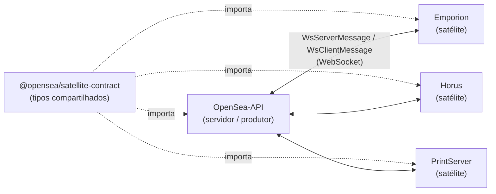

# `@opensea/satellite-contract`

> Tipos TypeScript compartilhados que definem o **contrato** entre o backend `OpenSea-API` e os satélites desktop do ecossistema OpenSea ERP — **Emporion**, **Horus** e **PrintServer**.


Elimina a duplicação de definições (eventos WebSocket, metadados de release, revogação de dispositivo) entre os N consumidores e centraliza o _mapping_ entre os nomes do **contract** e o **wire format** atualmente em produção.

> [!NOTE]
> Pacote **somente de tipos** (zero runtime além dos mappers). Distribuído via **Git URL público** — sem registry npm, sem SSH, sem secrets.

## 📑 Sumário

- [Visão geral](#-visão-geral)
- [Instalação](#-instalação)
- [Uso / API](#-uso--api)
- [Wire format vs contract names](#-wire-format-vs-contract-names)
- [Scripts](#-scripts)
- [Estrutura](#-estrutura)
- [Contribuindo](#-contribuindo)
- [Licença](#-licença)

## 🏗️ Visão geral

O `OpenSea-API` orquestra um conjunto de aplicações satélite que rodam nos terminais dos clientes. Toda a comunicação entre servidor e satélite (handshake, heartbeat, push de releases, revogação de dispositivo) trafega por mensagens WebSocket tipadas. Este pacote é a **fonte única de verdade** desses tipos: o servidor e cada satélite importam o mesmo contrato, garantindo que payloads e _discriminated unions_ não saiam de sincronia.



## 📦 Instalação

Distribuído via **Git URL público** (sem npm registry, sem SSH). Adicione ao `package.json` do consumidor, fixando a tag exata:

```json
{
  "dependencies": {
    "@opensea/satellite-contract": "git+https://github.com/OpenSea-ERP/OpenSea-Satellite-Contract.git#v0.1.0"
  }
}
```

Depois:

```bash
npm install
```

O repositório é **público** (apenas tipos TS, zero secrets), então qualquer ambiente — dev local, GitHub Actions, Fly.io, electron-builder — clona via HTTPS sem credenciais. O `dist/` é committado no repo, então o artefato vem pronto, sem necessidade de toolchain de build no consumidor.

### Atualizando a versão

Ao publicar uma nova tag (`v0.2.0` etc.), edite o sufixo `#vX.Y.Z` no `package.json` do consumidor e reinstale:

```bash
npm cache clean --force
rm -rf node_modules
npm install
```

> [!WARNING]
> O `npm` faz cache agressivo de URLs git e o sufixo de tag **não** invalida o cache sozinho — daí o `npm cache clean --force`.

## 🧩 Uso / API

```ts
import {
  SATELLITE_KINDS,
  toWireSatelliteKind,
  fromWireSatelliteKind,
  type SatelliteKind,
  type WsServerMessage,
  type WsAppReleasePublishedMessage,
} from '@opensea/satellite-contract';

// SatelliteKind: 'EMPORION' | 'PRINT_SERVER' | 'HORUS' (contract names)
const myKind: SatelliteKind = 'EMPORION';

// Converter para o wire format histórico ainda em uso na API/DB
const wire = toWireSatelliteKind(myKind); // 'POS_EMPORION'

// Receber um evento WS e fazer narrowing por `type`
function handle(msg: WsServerMessage): void {
  if (msg.type === 'app.release.published') {
    const release: WsAppReleasePublishedMessage = msg;
    if (release.kind === myKind) {
      console.log(`nova release de ${myKind}: ${release.version}`);
    }
  }
}
```

### Superfície exportada

| Símbolo | Tipo | Descrição |
| --- | --- | --- |
| `SATELLITE_KINDS` | `const` | `['EMPORION', 'PRINT_SERVER', 'HORUS']` — nomes canônicos (contract). |
| `SatelliteKind` | `type` | União dos kinds do contract. |
| `WIRE_SATELLITE_KINDS` | `const` | `['POS_EMPORION', 'PRINT_SERVER', 'PUNCH_AGENT']` — wire histórico. |
| `WireSatelliteKind` | `type` | União do wire format em produção. |
| `toWireSatelliteKind` | `fn` | `SatelliteKind → WireSatelliteKind`. |
| `fromWireSatelliteKind` | `fn` | `WireSatelliteKind → SatelliteKind`. |
| `WIRE_BY_KIND` / `KIND_BY_WIRE` | `const` | Tabelas de tradução nos dois sentidos. |
| `ReleaseInfo` | `type` | Metadados de uma release (`kind`, `version`, `downloadUrl`, `sha256`, `releaseNotes`, `isCritical`, `releasedAt`). |
| `WsHelloMessage` | `type` | Cliente → servidor: handshake com `deviceToken`. |
| `WsHeartbeatMessage` / `WsHeartbeatAckMessage` | `type` | Ping periódico do cliente e ack do servidor. |
| `WsWelcomeMessage` | `type` | Servidor → cliente: identidade do terminal + `latestRelease` (catch-up). |
| `WsAppReleasePublishedMessage` | `type` | Servidor → cliente: push de nova release (`extends ReleaseInfo`). |
| `WsDeviceRevokedMessage` / `DeviceRevokedReason` | `type` | Servidor → cliente: dispositivo descadastrado. |
| `WsServerMessage` | `type` | _Discriminated union_ de tudo que o servidor envia. |
| `WsClientMessage` | `type` | _Discriminated union_ de tudo que o cliente envia. |

## 🔀 Wire format vs contract names

Razão histórica: os primeiros satélites foram nomeados antes do contrato formal. Os valores em produção (DB Prisma enum, payloads WS, secrets em CI) usam nomes legados:

| Contract       | Wire (atual)    |
| -------------- | --------------- |
| `EMPORION`     | `POS_EMPORION`  |
| `PRINT_SERVER` | `PRINT_SERVER`  |
| `HORUS`        | `PUNCH_AGENT`   |

A migração para os nomes do contract no wire format será feita em **SAT-RELEASE-05** (enum Prisma aditivo + _dual-write_ transitório). Até lá, use sempre `SatelliteKind` no código novo e converta na borda de I/O com os mappers `toWireSatelliteKind` / `fromWireSatelliteKind`.

## 📜 Scripts

| Script | O que faz |
| --- | --- |
| `npm run build` | Compila `src/` → `dist/` via `tsc` (CJS). |
| `npm run rebuild` | `clean` + `build` (limpa `dist/` antes). |
| `npm run typecheck` | `tsc --noEmit` — checagem de tipos sem emitir. |
| `npm run test` | Testes unitários com Vitest (round-trip dos mappers). |
| `npm run test:types` | _Type tests_ com `tsd` (exige `dist/` atualizado). |
| `npm run lint` | `biome check`. |
| `npm run format` | `biome format --write`. |

## 🗂️ Estrutura

```
src/
├── index.ts                  # barrel: re-exporta toda a superfície pública
├── satellite-kind.ts         # SatelliteKind + SATELLITE_KINDS (contract names)
├── wire-mapping.ts           # WireSatelliteKind + mappers contract↔wire
├── release/
│   └── release-info.ts       # ReleaseInfo
└── ws/                       # mensagens WebSocket
    ├── index.ts              # barrel das mensagens
    ├── envelope.ts           # unions WsServerMessage / WsClientMessage
    ├── hello.ts              # WsHelloMessage
    ├── heartbeat.ts          # WsHeartbeatMessage / WsHeartbeatAckMessage
    ├── welcome.ts            # WsWelcomeMessage
    ├── app-release-published.ts  # WsAppReleasePublishedMessage
    └── device-revoked.ts     # WsDeviceRevokedMessage / DeviceRevokedReason
tests/                        # vitest (.test.ts) + tsd (.test-d.ts)
dist/                         # build committado (servido via git URL)
```

## 🤝 Contribuindo

Projeto pequeno: commits direto em `main` são aceitos; PR é recomendado para mudanças não-triviais (para rodar o CI antes do merge). O CI roda em todo push: typecheck → build → checagem de sincronia do `dist/` → testes → `tsd`.

> [!IMPORTANT]
> O `dist/` é **committado** no repo. Após mexer em `src/`, rode `npm run rebuild` e commite o `dist/` junto — o CI falha se `dist/` estiver fora de sincronia com a fonte.

O fluxo completo de release (bump de versão, CHANGELOG, _tag_ anotada, smoke test pós-tag) está em [`CONTRIBUTING.md`](./CONTRIBUTING.md). Histórico de versões em [`CHANGELOG.md`](./CHANGELOG.md).

## 📄 Licença

**PROPRIETARY** — OpenSea ERP. Uso exclusivo do ecossistema OpenSea. Veja [LICENSE](./LICENSE).
